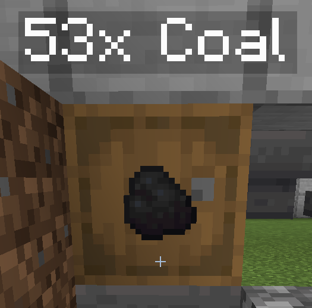

# Barrels

We have a plugin that brings new mechanics to barrels. Rather than just being reskinned chests, they can store near-unlimited amounts of a single item. It's pretty straightforward, but here is a small guide on how to use it.

### Creating a Barrel

Place a barrel and **right click** it while holding the item you want to add. This puts the item in the barrel, resulting in something like this:&#x20;

You can also **Shift + Right Click** to add all the items in your inventory

### Taking Items Out

To take a single item out, **Left Click** on the barrel

To take a whole stack out, **Shift + Left Click**

****

### **Mechanics**

Barrels still work with hoppers, making them particularly useful for automatic farms and smelters
